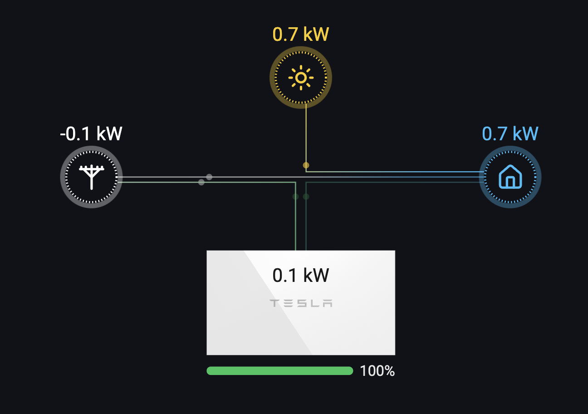

# Power Flow diagram for pypowerwall

## Running

To run on port 3000 with your pypowerwall URL as `http://localhost:8675`:

`docker run --rm -p 3000:3000 -e "PYPOWERWALL_URL=http://localhost:8675" mccahan/power-flow:latest`

